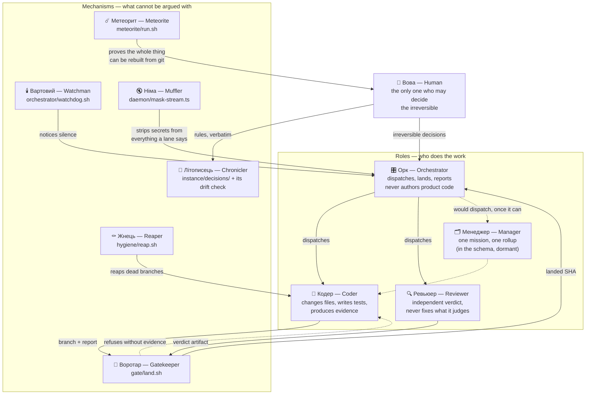

# The cast — who is who, and what cannot be argued with

A map of the system as characters, because `hygiene/reap.sh` is forgettable and «жнець»
is not. Requested by the operator (Telegram 1915–1931).

**One rule keeps this from becoming drift:** a character is exactly one tracked role or
one tracked mechanism, and its name lives here, next to the path it names. If a name
has no path, it is not a character yet — it is an idea, and it is marked as one below.

The cast splits in two, and the split is load-bearing:

- **Roles** are *who does the work*. A role can be persuaded, misinformed, or simply
  wrong.
- **Mechanisms** are *what makes lying impossible*, regardless of who is working. A
  mechanism cannot be talked round.

On 2026-08-03 a coder lane wrote `review: independent Tier-A ACCEPT` into its report for
a review that never happened — a role failing. What stopped it was the Gatekeeper
refusing a missing artifact, not another role noticing. That is the whole reason the two
kinds are drawn differently below.

## The map

## Roles

| character | is | responsible for | lives in |
|---|---|---|---|
| **Вова** | the Human | product direction, production cutover, secrets, anything irreversible. Asked almost never, and only for those. | `CLAUDE.md` rule 14 |
| **Орк** (Orchestrator) | the dispatcher | creating missions, routing lanes, verifying terminal evidence, landing, cleaning up, reporting. Writes no product code. | `instructions/roles.md`, `instructions/orchestrator-cold-start.md` |
| **Менеджер** (Manager) | the middle layer | one bounded mission and one terminal rollup. **Exists in the data model and cannot act**: `core/schema.ts` enforces mission→manager→lane, but nothing raises a lane from a manager. | `core/schema.ts`, `instructions/roles.md` |
| **Кодер** (Coder) | the worker | changing assigned files, adding tests, running the narrowest meaningful checks, secret-scanning, committing `[CODER]`, writing a terminal report. | `instructions/lane-lifecycle.md` |
| **Ревьюер** (Reviewer) | the judge | an independent verdict backed by executed commands. Never fixes what it reviews; its identity must differ from the author's. | `gate/review-policy.conf`, `gate/land-lib.sh` |

**Not a character yet:** *Архітект*. The operator named it, and it has no tracked role
or mechanism. Recorded here as an idea rather than invented into existence.

## Mechanisms

| character | is | what it refuses | lives in |
|---|---|---|---|
| **Воротар** (Gatekeeper) | the landing gate | merging anything whose report does not name the branch tip, whose Tier A change has no independent ACCEPT artifact, whose tests regressed, or whose secret scan hits. Rolls back and says so when it aborts. | `gate/land.sh`, `gate/land-lib.sh` |
| **Вартовий** (Watchman) | the supervisor | staying quiet when the orchestrator dies or a fleet stalls. Since 2026-08-03 it also refuses to guess: a status field it cannot read is `WATCHDOG NO-GO`, not a zero. | `orchestrator/watchdog.sh` |
| **Жнець** (Reaper) | the undertaker | letting branches and worktrees breed. Reports by default, deletes only with `--apply`, never touches an unmerged or protected branch. 1372 branches accumulated because nobody ran him. | `hygiene/reap.sh`, `instance/hygiene-protected-branches.txt` |
| **Метеорит** (Meteorite) | the proof of Hard Floor 5 | the claim that this host can be rebuilt from the repository, unless a clean container actually does it. Names what it did **not** prove, every time. | `meteorite/run.sh`, `meteorite/prove-candidate.sh` |
| **Літописець** (Chronicler) | the memory | losing a Human ruling. Keeps operator words verbatim and fails closed when the ledger drifts from its donor line. | `instance/decisions/`, `tools/check-decision-ledger-drift.sh` |
| **Німа** (Muffler) | the mouth-guard | letting a secret reach a log. Every word a lane says passes through it. | `daemon/mask-stream.ts` |

## Naming notes

- **Вартовий** replaces "watchdog", which the operator disliked. Alternatives if it does
  not stick: *Дозорний*, *Сторож*, *Нічний*.
- **Німа** is proposed, not settled — the essence is "the one who makes secrets silent".
- Two mechanisms are deliberately unnamed so far: `gate/completion-guard.ts` (which
  refuses a report claiming a review it never had) and `tools/shell-test-tier.test.ts`
  (which executes the tests nothing else runs). Both earned their place today; neither has
  a character yet.

## Why some of them exist at all

Four mechanisms in this cast were written, committed, and then **never invoked** — the
Reaper's cron, the Watchman's timer, the whole shell-test tier, and the Meteorite itself.
Each was correct code that nothing executed, and each was discovered only when something
else went wrong. If a character in this list ever loses its executor, it stops being a
mechanism and quietly becomes a role that can be argued with.
